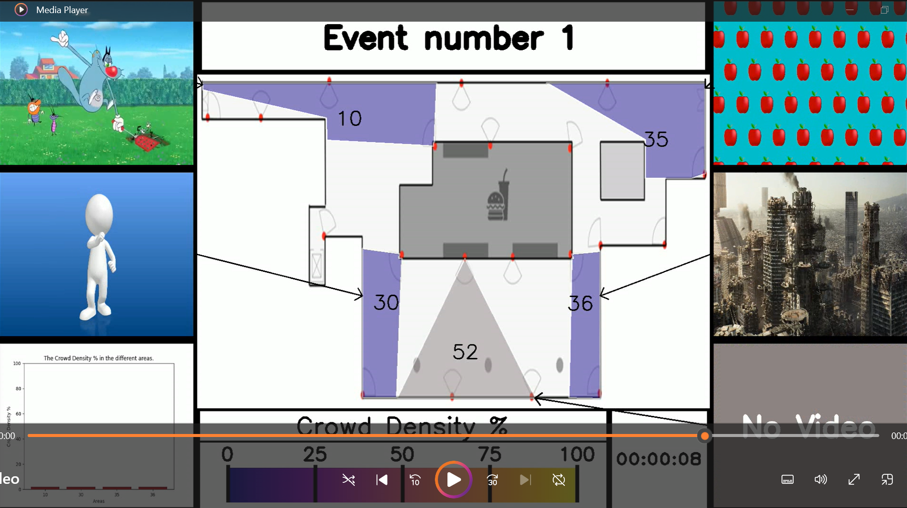

# Crowd Density Heatmap Video

---
## Overview

#### Description

This project is designed to create a heatmap video to visualise crowd density in specific areas of a building.
This provides an automated tool that can be used to improve safety and resource efficiency for building managers.

#### How it works

If an area of the building is covered by CCTV footage, we can analyse this footage to extract a crowd density value.
This value can then be used to colour the respective area on a floor plan of the building. 
This heatmap of coloured areas overlaid on a floor plan can then be paired with the original CCTV footage, a timestamp, and other useful components to create a video of the changes in crowd density of each area over time.

Each frame of the final video looks as follows:


#### Consequences

This project was originally completed as part of the Croke Park Smart Stadium Project under the guidance of The Insight Centre for Data Analytics, DCU.
This project allowed Croke Park stadium to better understand crowd behaviours in their stadium, in turn allowing them to:
- improve crowd safety
- optimise staff deployment
- effectively trial new programmes
- enhance crowd satisfaction
- increase advertising revenues


---
## Installation

1. **Clone the repository:**
   ```bash
   git clone https://github.com/yourusername/yourproject.git
   cd yourproject
   ```

1. **Install dependencies:**
	```bash
	pip install -r requirements.txt
	```


---
## Usage

1. **Create a heatmap video:**
	- User prompting:
		```bash
		python3 ./code/create_heatmap_video.py
		```
	- Command line arguments:
		```bash
		python3 ./code/create_heatmap_video.py -bi data/floor_plans/level_5.png -cf data/density_csvs -of ./video.mp4 -af data/area_outlines/level_5.json -ef data/event_details/level_5.txt -vf data/cctv_videos
		```

1. **Draw areas on an image:**
	- User prompting:
		```bash
		python3 ./code/draw_areas.py
		```
	- Command line arguments:
		```bash
		python3 ./code/draw_areas.py -bi data/floor_plans/level_5.png -of ./area_details_file.json
		```

1. **Create Component:**

	Each file in the `./code/components` directory can be run seperately to create that individual component.
	For this to work, the import paths in this file need to be changed to be relative to this file.
	Changing these paths will break the other main programs so these paths should be changed back after.


---
## Repository Breakdown

#### [`code/`](code)

The `code/` directory contains all the source code files and scripts for the project.

These files break down as follows:
- [`components`](code/components): Encapsulates components of the heatmap in their own class. Makes it possible to generate these components seperate of the rest of the code
- [`data_models`](code/data_models): Classes that store parts of the data efficiently, making accessing information or modifying it very efficient.
- [`input_handlers`](code/input_handlers): Handle retrieving the progam inputs from the user and validating them.
- [`input_output`](code/input_output): Read significant input data efficiently, such as the CCTV videos.
- [`utils`](code/utils): Utility functions that help the rest of the code work effectively
- [`create_heatmap_video.py`](code/create_heatmap_video.py): Program that ties all the code together to create a heatmap video.
- [`draw_areas.py`](code/draw_areas.py): Program to draw areas on a given background image.
- [`plot_density_data.ipynb`](code/plot_density_data.ipynb): Inital analysis done to plot the crowd density data over time.

#### [`configs/`](configs)

The `configs/` directory contains the configuration files that control parameters during the construction of the heatmap video.

Almost everything in the output video is configurable and can be adjusted with ease by editing the `.yaml` files.
These files break down as follows:
- [`colourmap_configs.yaml`](configs/colourmap_configs.yaml): Configure the colourmap component. These include the sizes of its internal components, their colours, and even font types.
- [`default_configs.yaml`](configs/default_configs.yaml): Configure the default input and output settings. These include info on the data, video output settings, component proportions, and default paths.
- [`drawing_configs.yaml`](configs/drawing_configs.yaml): Configure the `draw_areas.py` program. These include the default shape to draw and colour settings.
- [`heatmap_configs.yaml`](configs/heatmap_configs.yaml): Configure the `create_heatmap_video.py` program. These include the colours and sizes of borders and fonts, and settings for minor components.
- [`video_resolutions.yaml`](configs/video_resolutions.yaml): Define a list of widely accepted video resolutions and their height and width proportions.

> Note: If the data is changed, the `default_configs.yaml` file should be adjusted to reflect this.

#### [`data/`](data)

The `data/` directory contains the necessary datasets for the project.

> Note: Due to the personal nature of the CCTV footage and floor plans, this data was not included in the dataset pushed to git.

This dirctory is structured so that there is a folder for each input required to construct the heatmap video.
This gives a good organisation to storing the expected program inputs.
These folders break down as follows:
- [`area_outlines`](data/area_outlines): Coordinate details of the areas to visualise on the floor plan.
- [`cctv_videos`](data/cctv_videos): CCTV videos to be used in the heatmap video.
- [`density_csvs`](data/density_csvs): CSVs containing the density values extracted from the CCTV videos.
- [`event_details`](data/event_details): Details of events which happened in the building at various times.
- [`floor_plans`](data/floor_plans): Floor plan images that the areas are overlaid on.

> Note: The `cctv_videos` and `density_csvs` folder must contain the same number of files. This must also match the number of areas detailed in the chosen `area_outlines` file.

#### [`docs/`](docs)

The `docs/` folder contains any documents for the project.

#### [`requirements.txt`](requirements.txt)

Lists all Python dependencies required to run the project.

#### [`README.md`](readme.md)

This file! Contains the overview and instructions for the project.
